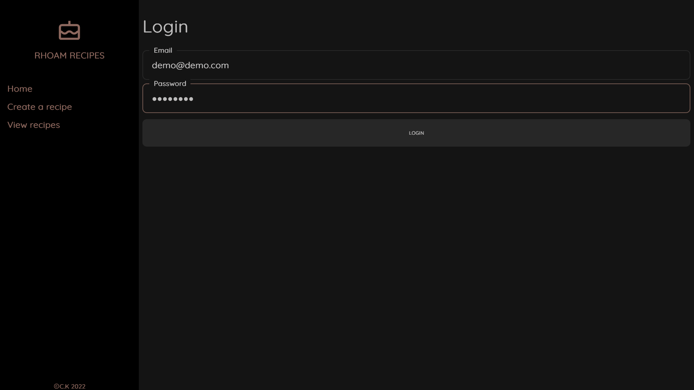
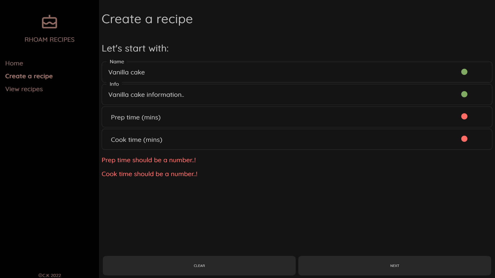
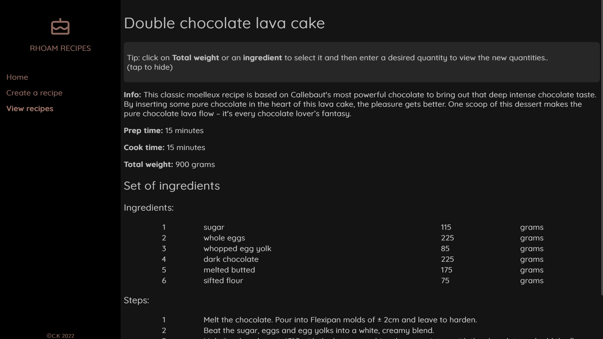
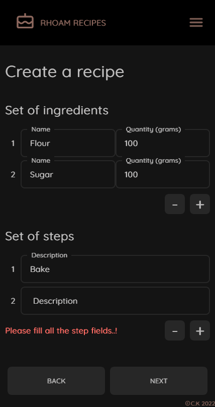
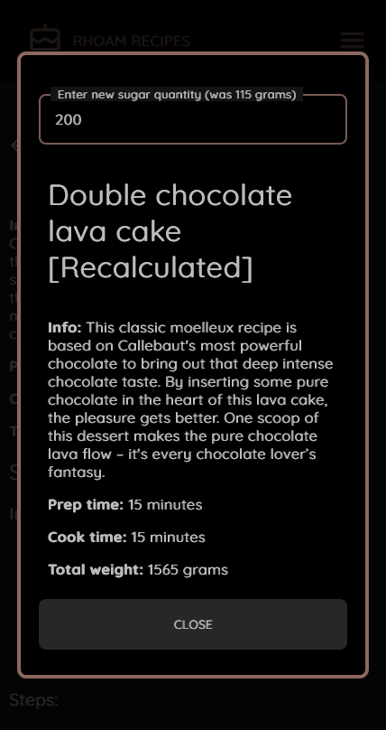

# RhoamRecipes

An app that intends to help pastry chefs who want to execute recipes on different quantities for production purposes.

A TypeScript ReactJS app that connects to Google Firebase.

## Available features

You can create a recipe..! After logging in, you can save it in our API and view it for production.

(you can use demo@demo.com, demodemo as the credentials for a demo use)

Create a recipe by using the wizard..!

Each recipe can have multiple sets of ingredients.
A set of ingredients is a collection of ingredients and steps..!

Afterwards you can select the recipe that you want to view..

... by click on an ingredient or on the total weight of the mixture.

Finally, input the new value, and the app will calculate the new ingredient quantities..!

Rhoam recipes is built handheld-device first..! After all, it's used in the kitchen!

On your smartphone..

..or on your tablet..!

You can find the previous version of the app

1.  ReactNative + ExpressJS: <https://github.com/xk2102/rhoam-recipes-mobile>
